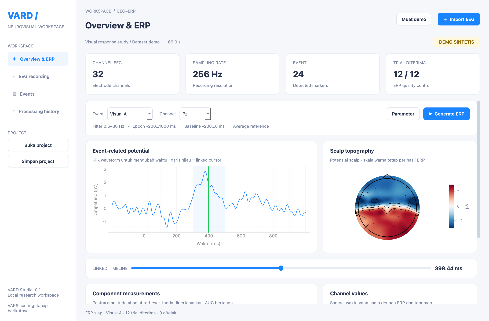
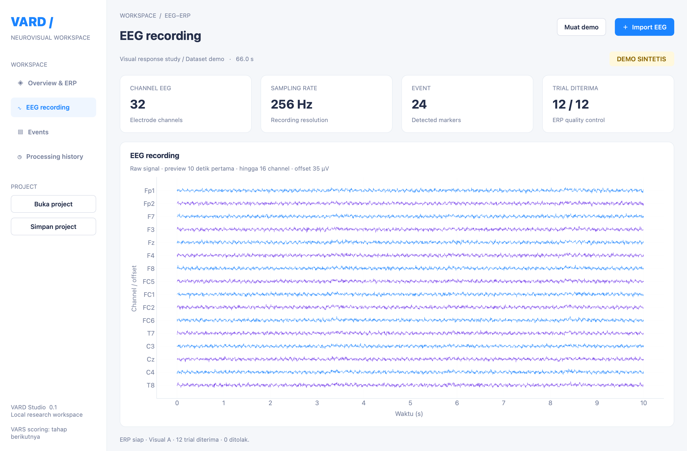
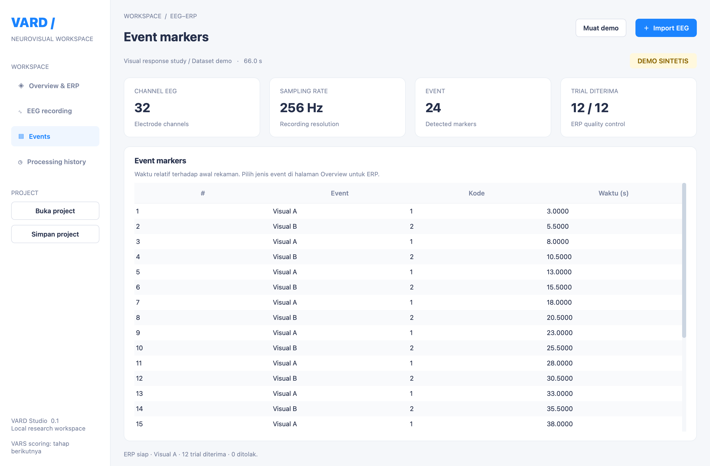
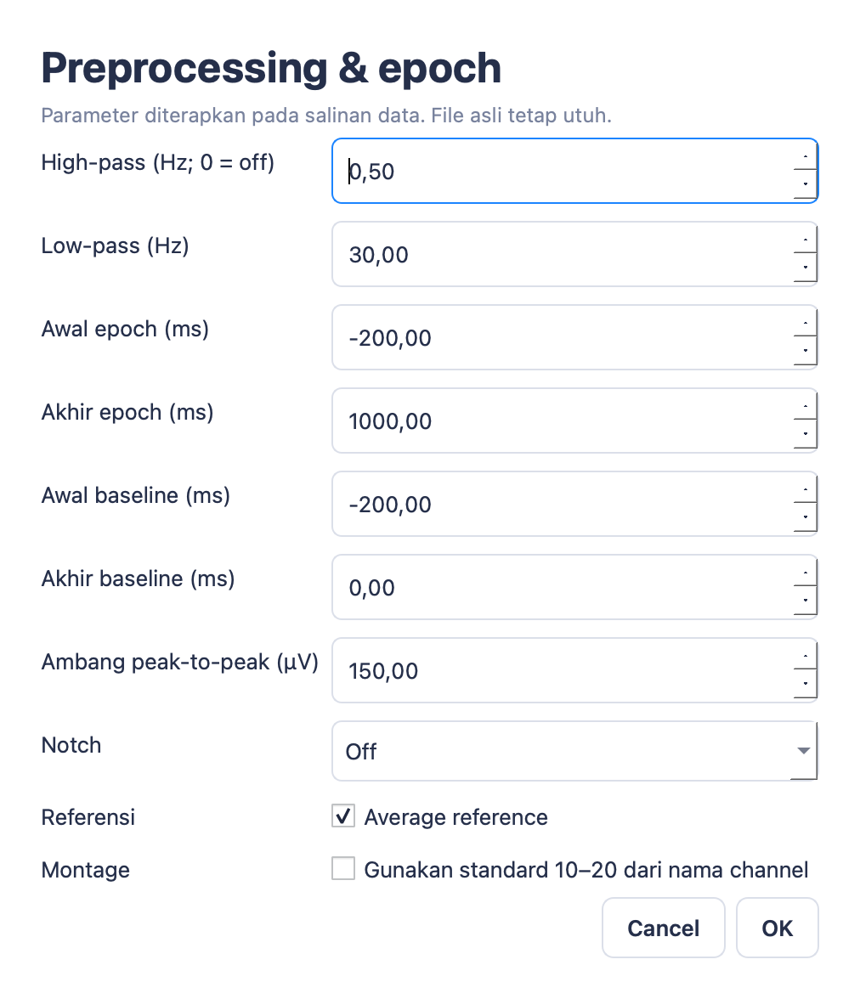
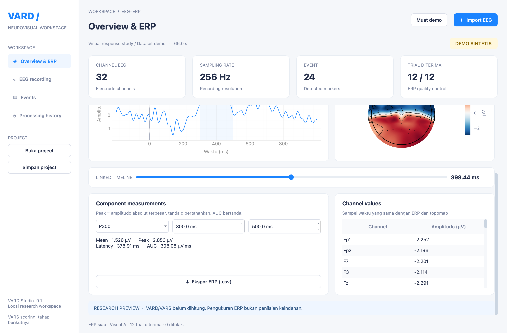
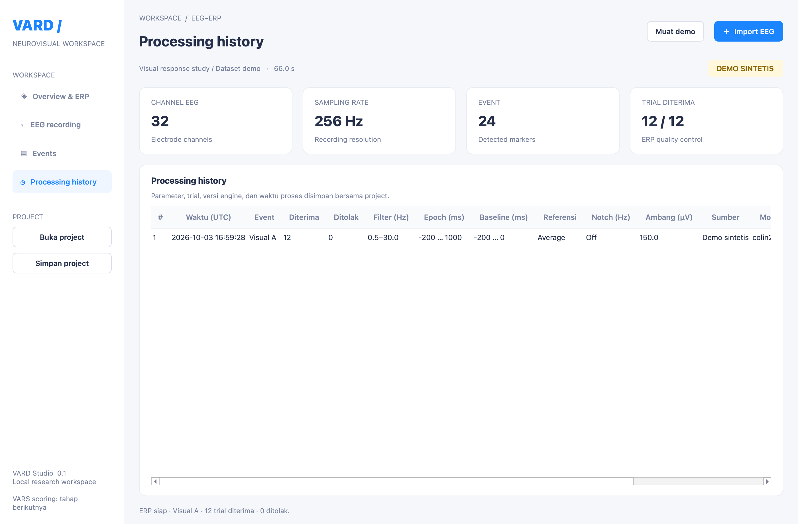
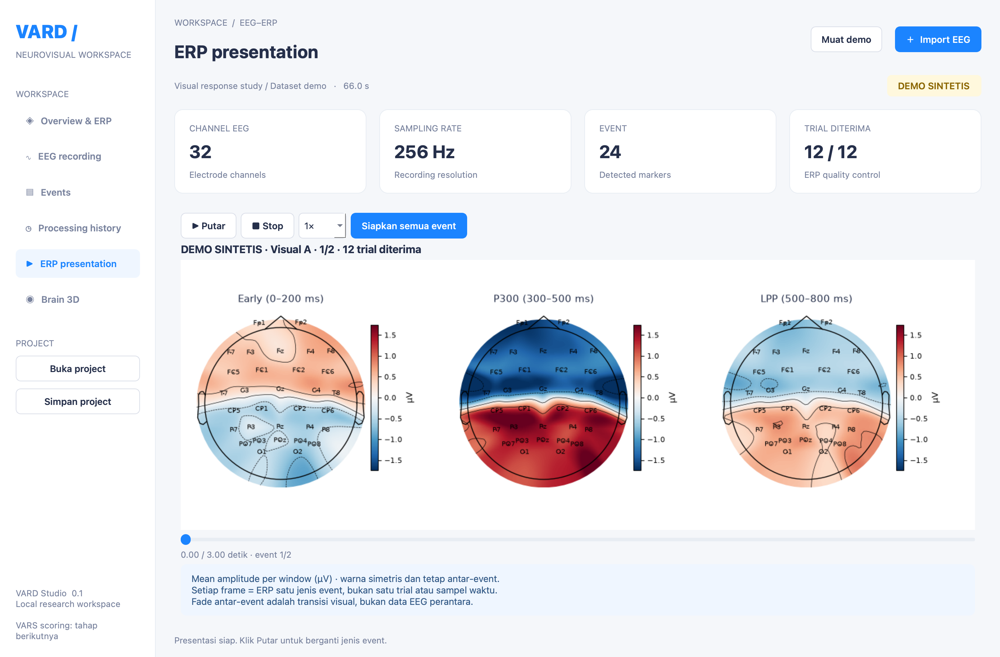
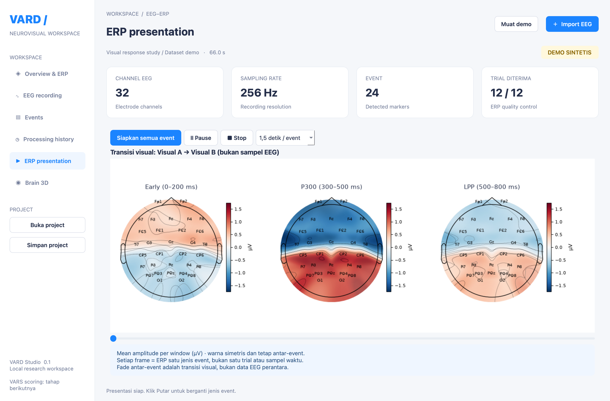
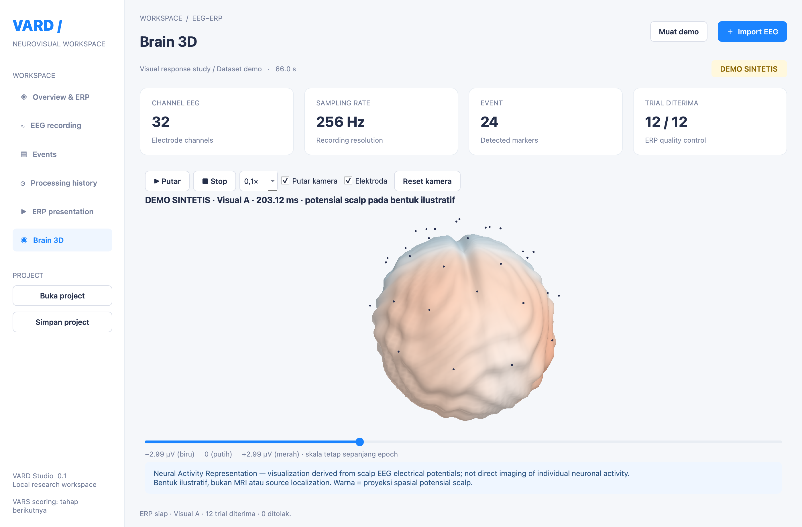

# Panduan Pengguna VARD Studio

**Versi aplikasi:** 0.1 · **Platform panduan:** macOS · **Diperbarui:** 3 Oktober 2026

Panduan ini menjelaskan cara menjalankan aplikasi, melihat EEG, menghasilkan ERP, membaca topomap, serta menyimpan dan mengekspor hasil. Semua screenshot diambil langsung dari aplikasi menggunakan **data demo sintetis**, bukan rekaman partisipan.

## Daftar isi

1. [Menjalankan aplikasi](#1-menjalankan-aplikasi)
2. [Mengenal dashboard](#2-mengenal-dashboard)
3. [Membuka rekaman EEG](#3-membuka-rekaman-eeg)
4. [Memeriksa event](#4-memeriksa-event)
5. [Mengatur parameter analisis](#5-mengatur-parameter-analisis)
6. [Menghasilkan ERP dan menggunakan timeline](#6-menghasilkan-erp-dan-menggunakan-timeline)
7. [Membaca pengukuran komponen](#7-membaca-pengukuran-komponen)
8. [Menyimpan dan membuka project](#8-menyimpan-dan-membuka-project)
9. [Mengekspor hasil CSV](#9-mengekspor-hasil-csv)
10. [Melihat processing history](#10-melihat-processing-history)
11. [Mengatasi masalah umum](#11-mengatasi-masalah-umum)
12. [Batas versi awal](#12-batas-versi-awal)
13. [Presentasi ERP](#13-presentasi-topomap-seperti-video-referensi)
14. [Animasi otak 3D](#14-animasi-otak-3d)

## 1. Menjalankan aplikasi

Di Terminal, masuk ke folder proyek lalu jalankan:

```bash
cd /Users/supriyanto/Desktop/Project/VAG-EEG-ERP
venv/bin/python run.py
```

Lokasi di atas sesuai workspace pengembangan ini. Sesuaikan path jika proyek dipindahkan. Untuk instalasi pertama, ikuti [panduan setup](development.md#mac).

Aplikasi otomatis memuat demo 32 channel, sampling rate 256 Hz, dan 24 event. Tunggu hingga status di bagian bawah menyatakan **ERP siap**. Badge **DEMO SINTETIS** menandai bahwa data ini hanya untuk mencoba fungsi aplikasi.

Untuk memulai dengan workspace kosong:

```bash
venv/bin/python run.py --empty
```

## 2. Mengenal dashboard



*Gambar 1. Halaman Overview & ERP setelah demo selesai diproses.*

| Bagian | Fungsi |
|---|---|
| Sidebar kiri | Berpindah antara Overview & ERP, EEG recording, Events, dan Processing history |
| Muat demo | Memuat ulang dataset sintetis bawaan |
| Import EEG | Membuka file BDF atau EDF dari komputer |
| Kartu ringkasan | Menampilkan jumlah channel EEG, sampling rate, event, dan trial diterima |
| Event dan Channel | Memilih kelompok event untuk ERP dan elektroda yang ditampilkan |
| Parameter | Mengatur preprocessing, epoch, baseline, serta montage |
| Generate ERP | Menghitung hasil dengan event dan parameter terpilih |
| Linked timeline | Mengubah sampel waktu pada ERP, topomap, dan tabel channel |
| Status bagian bawah | Menampilkan progres, hasil proses, atau pesan kesalahan |

Scroll panel analisis ke bawah untuk melihat **Component measurements**, **Channel values**, dan tombol ekspor. Tema terang tetap digunakan ketika macOS memakai dark mode.

## 3. Membuka rekaman EEG

1. Klik **Import EEG** di kanan atas.
2. Pilih file berekstensi `.bdf` atau `.edf`.
3. Tunggu pembacaan metadata dan event selesai.
4. Periksa nama sumber dan kartu ringkasan.
5. Klik **EEG recording** pada sidebar untuk melihat sinyal mentah.

Jika terdapat perubahan project yang belum disimpan, aplikasi akan menawarkan penyimpanan sebelum mengganti rekaman. File EEG asli tetap utuh saat dianalisis.



*Gambar 2. Preview EEG mentah. Contoh gambar tetap menggunakan demo sintetis.*

Preview versi awal menampilkan **10 detik pertama**, hingga **16 channel**, dengan offset vertikal 35 µV antar-waveform. Jumlah channel pada kartu ringkasan tetap menunjukkan seluruh channel EEG. Tampilan ini belum menyediakan penandaan bad channel atau pemilihan bagian rekaman lain.

## 4. Memeriksa event

Klik **Events** pada sidebar. Tabel berisi nomor urut, nama event, kode trigger, serta waktu relatif terhadap awal rekaman dalam detik.



*Gambar 3. Daftar event pada demo. Nama dan kode pada rekaman sendiri mengikuti isi file.*

Pada Overview, pilih jenis event yang ingin dianalisis melalui dropdown **Event**. Misalnya, **Visual A** memilih trial dengan kode 1 pada demo. Mengganti event menghapus tampilan hasil sebelumnya; klik **Generate ERP** untuk menghitung hasil baru.

Jika event tidak ditemukan, EEG masih bisa ditampilkan, tetapi ERP belum dapat dihitung. Versi ini memerlukan trigger atau annotation dari file; penambahan event manual belum tersedia. Tabel menampilkan maksimal 5.000 event, sementara analisis memakai seluruh event untuk jenis yang dipilih.

## 5. Mengatur parameter analisis

Kembali ke **Overview & ERP**, lalu klik **Parameter**.



*Gambar 4. Dialog parameter. Nilai bawaan merupakan konfigurasi demo dan perlu disesuaikan dengan protokol penelitian.*

| Pengaturan | Arti |
|---|---|
| High-pass | Batas bawah filter dalam Hz; nilai 0 menonaktifkan high-pass |
| Low-pass | Batas atas filter dalam Hz; harus di bawah setengah sampling rate |
| Awal / akhir epoch | Rentang analisis relatif terhadap onset stimulus, dalam ms |
| Awal / akhir baseline | Rentang koreksi baseline; harus berada di dalam epoch |
| Ambang peak-to-peak | Menolak epoch jika rentang amplitudo EEG melampaui ambang dalam µV |
| Notch | Pilihan Off, 50 Hz, atau 60 Hz |
| Average reference | Menggunakan referensi rata-rata; jika tidak dicentang, referensi asli dipertahankan |
| Montage | Menerapkan posisi standard 10–20 berdasarkan nama channel jika dicentang |

Aktifkan montage standard 10–20 hanya jika nama dan susunan elektroda pada rekaman memang sesuai. Bila posisi elektroda tidak lengkap, panel topomap akan menampilkan penjelasan, bukan mengarang posisi.

Klik **OK** untuk menyimpan parameter, kemudian **Generate ERP** untuk menerapkannya. Klik **Cancel** untuk kembali tanpa menerapkan perubahan. Jika parameter tidak valid, aplikasi menampilkan pesan kesalahan dan mempertahankan konfigurasi sebelumnya.

## 6. Menghasilkan ERP dan menggunakan timeline

1. Pilih **Event** yang tersedia.
2. Periksa parameter analisis.
3. Klik **Generate ERP** dan tunggu proses selesai.
4. Periksa kartu **TRIAL DITERIMA**. Pada demo Visual A, contoh hasilnya 12 dari 12 trial.
5. Pilih **Channel**, misalnya `Pz`, untuk menampilkan waveform elektroda tersebut.
6. Klik waveform, geser garis hijau, atau gunakan slider **LINKED TIMELINE**.

Waveform menggunakan waktu dalam **ms** dan amplitudo dalam **µV**. Onset stimulus berada di 0 ms. Garis hijau, nilai channel, dan topomap memakai indeks sampel yang sama.

Pada demo 256 Hz, memilih 400 ms mengambil sampel terdekat yaitu **398.4375 ms**, ditampilkan sebagai **398.44 ms**. Perbedaan kecil tersebut berasal dari interval sampling.

Topomap menampilkan sebaran potensial scalp pada waktu terpilih. Warna mengikuti nilai serta polaritas pada colorbar. Rentang warna tetap selama berpindah waktu dalam satu hasil ERP, sehingga perubahan warna dapat dibandingkan pada skala yang sama. Visualisasi ini bukan citra anatomi atau pengukuran neuron individual.

## 7. Membaca pengukuran komponen

Scroll panel Overview ke bawah.



*Gambar 5. Pengukuran komponen dan nilai channel pada dataset demo.*

Pilih komponen **P300**, **LPP**, **Early visual**, atau **Custom**. Rentang awalnya adalah:

| Komponen | Window awal |
|---|---|
| P300 | 300–500 ms |
| LPP | 500–800 ms |
| Early visual | 0–200 ms |
| Custom | Diatur melalui dua kolom waktu |

Mengubah kolom waktu otomatis memilih Custom. Window harus berada di dalam epoch dan mencakup minimal dua sampel. Pemilihan window merupakan pengaturan pengukuran, bukan bukti otomatis bahwa suatu komponen fisiologis telah terdeteksi.

| Nilai | Penjelasan |
|---|---|
| Mean | Amplitudo rata-rata channel terpilih dalam window, dalam µV |
| Peak | Amplitudo dengan nilai absolut terbesar dalam window; tanda asli dipertahankan |
| Latency | Waktu sampel peak relatif stimulus onset, dalam ms |
| AUC | Integral amplitudo bertanda terhadap waktu, dalam µV·ms |

Tabel **Channel values** menampilkan nilai sesaat pada cursor, sedangkan pengukuran komponen merangkum rentang waktu. Keduanya dapat memiliki nilai berbeda karena metode pengukurannya berbeda.

## 8. Menyimpan dan membuka project

### Menyimpan

1. Klik **Simpan project** di sidebar.
2. Pilih folder dan nama file, misalnya `riset-visual.vard.json`.
3. Periksa pesan berhasil pada status bagian bawah.

Project menyimpan referensi rekaman sumber, parameter analisis, event, history, serta pilihan channel, window, dan cursor. File EEG tetap terpisah dari manifest project.

### Membuka kembali

1. Klik **Buka project**.
2. Pilih file `.vard.json`.
3. Tunggu hingga rekaman dan tampilan selesai dipulihkan.

Jika sebelumnya project memiliki hasil ERP, aplikasi menghitung ulang hasil dari sumber dan parameter tersimpan. Proses rekonstruksi dicatat dalam history. Hasil dapat berubah jika file sumber atau versi engine berubah.

Saat memindahkan project ke komputer lain, sertakan file EEG dan pertahankan hubungan foldernya. Jika sumber tidak ditemukan, aplikasi menunjukkan lokasi yang diperlukan. Project demo tidak membutuhkan file EEG terpisah karena sinyal demo dibuat ulang.

## 9. Mengekspor hasil CSV

1. Pastikan hasil ERP sudah tersedia.
2. Scroll ke **Component measurements**.
3. Klik **Ekspor ERP (.csv)**.
4. Pilih nama file dan lokasi penyimpanan.
5. Tunggu pesan ekspor selesai.

CSV berisi **waveform ERP seluruh channel** untuk event terpilih, satu baris per sampel waktu. Pilihan window komponen tidak memotong isi ekspor.

| Kolom | Isi |
|---|---|
| `time_ms` | Waktu relatif stimulus onset |
| `event` | Nama event yang dianalisis |
| `synthetic_demo` | `True` jika sumber adalah demo sintetis |
| `accepted_trials` | Jumlah trial yang membentuk ERP |
| `<channel>_uV` | Amplitudo masing-masing channel dalam µV |

Pengukuran komponen, topomap, dan history tidak termasuk dalam CSV waveform ini. Simpan project untuk mempertahankan parameter dan riwayat analisis.

## 10. Melihat processing history

Klik **Processing history** pada sidebar.



*Gambar 6. Riwayat analisis ditampilkan sebagai tabel; satu baris mewakili satu proses.*

Riwayat mencatat sumber data, waktu proses dalam UTC, event, konfigurasi preprocessing, montage, jumlah trial diterima/ditolak, alasan penolakan, serta versi engine dan aplikasi. Riwayat ikut disimpan saat project disimpan. Geser tabel ke kanan untuk melihat kolom tambahan seperti sumber, montage, dan versi engine. Arahkan pointer ke sel untuk melihat detail sumber, metode filter, dan alasan penolakan.

## 11. Mengatasi masalah umum

| Gejala | Langkah yang dapat dilakukan |
|---|---|
| Generate ERP tidak aktif | Pastikan rekaman sudah dimuat, event tersedia, dan tidak ada proses lain yang berjalan |
| Hasil hilang setelah mengganti event/parameter | Klik Generate ERP untuk menghitung ulang dengan konfigurasi baru |
| Seluruh epoch ditolak | Periksa batas epoch, posisi event, kualitas sinyal, dan ambang artefak sesuai protokol penelitian |
| Topomap belum tersedia | Periksa posisi elektroda; gunakan montage standard hanya jika sesuai dengan rekaman |
| Window komponen tidak valid | Pastikan awal lebih kecil dari akhir, berada dalam epoch, dan mencakup minimal dua sampel |
| Sumber project tidak ditemukan | Kembalikan file EEG ke lokasi yang ditunjukkan atau pulihkan struktur folder project |
| Panel pengukuran/ekspor belum terlihat | Scroll area analisis pada Overview ke bawah |
| Aplikasi belum bisa ditutup saat memproses | Tunggu worker selesai; pembatalan proses aktif belum tersedia |
| Aplikasi gagal dijalankan | Periksa virtual environment dan langkah pemulihan pada [panduan pengembangan](development.md) |
| Pesan “no Qt platform plugin could be initialized” | Jalankan kode terbaru dengan `venv/bin/python run.py`; launcher memulihkan atribut plugin Qt di Mac secara otomatis. Lihat [diagnostik Qt](development.md#error-plugin-qt) jika masih gagal |

## 12. Batas versi awal

Versi 0.1 mendukung satu rekaman per project. VARS, impor MAT/SET, event editing, penolakan epoch manual, ICA, analisis multi-subjek, source localization, dan ekspor video belum tersedia. Tampilan demo tidak menunjukkan skor estetika.

Aplikasi sudah diuji pada Mac ARM64 menggunakan data sintetis. Validasi terhadap rekaman penelitian dan pipeline MATLAB/EEGLAB belum selesai. Lihat [laporan pengujian](validation.md) untuk rincian; build `.exe` Windows belum dibuat.

---

[Kembali ke daftar dokumentasi](README.md) · [Panduan setup dan pengembangan](development.md)

## 13. Presentasi topomap seperti video referensi

Halaman **ERP presentation** mengikuti susunan video referensi pengguna: tiga topomap berdampingan untuk **Early 0–200 ms**, **P300 300–500 ms**, dan **LPP 500–800 ms**, lalu berganti kelompok event.



1. Muat demo atau import EEG dan atur parameter di Overview.
2. Buka **ERP presentation** pada sidebar.
3. Klik **Siapkan semua event** dan tunggu analisis selesai.
4. Klik **Putar**. Gunakan **Pause** untuk berhenti sementara atau **Stop** untuk kembali ke frame pertama.
5. Pilih kecepatan 0,1× / 0,25× / 0,5× / 1× seperti Brain 3D. Geser slider untuk berpindah posisi; indikator menampilkan waktu presentasi dan nomor event. Pada 1×, setiap event berdurasi 1,5 detik.

Setiap panel menunjukkan **mean amplitude bertanda dalam µV** pada window terkait. Warna menggunakan skala simetris yang sama untuk seluruh panel dan event dalam satu presentasi. Nama elektroda ditampilkan jika posisi tersedia. Metode warna/normalisasi video referensi tidak diketahui, sehingga angka dan warna pada video tidak disalin sebagai hasil analisis.

Satu frame adalah rata-rata trial **satu jenis event**, bukan satu stimulus individual kecuali kode event memang memetakan stimulus tersebut. Demo memiliki dua kelompok: Visual A dan Visual B. Panel ini merangkum rentang waktu, sehingga berbeda dari topomap sesaat pada linked cursor Overview. Pemutaran tidak mengubah pilihan event/cursor Overview.

Epoch harus mencakup ketiga window. Jika posisi elektroda belum lengkap, panel menampilkan pesan. Mengubah event atau parameter di Overview menghapus presentasi lama; klik Siapkan semua event lagi. Pemutaran berhenti saat meninggalkan halaman atau memulai proses lain. Hasil analisis dicatat di Processing history; frame presentasi perlu disiapkan kembali setelah membuka project.

Fitur ini menampilkan animasi presentasi langsung dalam aplikasi. Ekspor MP4 belum tersedia; video referensi hanya digunakan sebagai acuan tata letak dan pergantian frame. Perhitungan topomap menggunakan [MNE plot_topomap](https://mne.tools/stable/generated/mne.viz.plot_topomap.html).


### Transisi ERP yang lebih mulus



Gambar setiap event disiapkan sebelum tombol Putar aktif. Saat diputar, aplikasi memakai cache gambar dan fade bertahap; topomap tidak dihitung ulang tiap frame. Teks **Transisi visual** muncul ketika dua gambar dibaurkan. Campuran tersebut merupakan efek presentasi, bukan nilai EEG antara dua event. Pause mempertahankan posisi persis, termasuk saat fade; Putar melanjutkan posisi tersebut. Stop kembali ke awal. Setelah selesai, Putar memulai kembali dari awal. Waktu pada slider adalah waktu presentasi, bukan waktu sampel EEG. Presentasi dibatasi 64 jenis event untuk membatasi memori.

## 14. Animasi otak 3D



1. Muat demo, atau import rekaman lalu Generate ERP pada Overview.
2. Pilih **Brain 3D** di sidebar.
3. Drag dengan mouse untuk memutar sudut pandang dan scroll untuk zoom.
4. Klik **Putar** untuk menjalankan timeline ERP. Pilih kecepatan 0,1×, 0,25×, 0,5×, atau 1×.
5. Gunakan **Pause**, **Stop**, atau slider untuk memilih sampel. Stop kembali ke awal epoch.
6. Centang **Putar kamera** untuk orbit otomatis selama playback, dan **Elektroda** untuk menampilkan penanda.
7. **Reset kamera** mengembalikan sudut pandang awal. Label A/P/L/R menandai anterior/posterior/left/right dalam koordinat ilustrasi.

Timeline 3D memakai sampel ERP yang sama dengan Overview. Saat kembali ke Overview, cursor, topomap, dan tabel channel disinkronkan dengan sampel terakhir. Pemutaran berhenti di akhir epoch, saat berpindah halaman, atau ketika analisis baru dimulai.

Warna berubah mengikuti potensial channel dalam µV, dengan skala tetap sepanjang epoch. Posisi elektroda harus lengkap; tanpa montage yang sesuai, aktivitas tidak ditampilkan. Model memakai bentuk matematis berlipat yang ilustratif, bukan MRI subjek. Penanda elektroda dinormalisasi ke permukaan ilustrasi, bukan posisi anatomi yang diregistrasi. Potensial scalp diproyeksikan dengan bobot spasial berdasarkan arah elektroda; ini **bukan estimasi sumber aktivitas otak**, neuron individual, atau diagnosis.

3D memerlukan OpenGL dan PyOpenGL. Dependensi sudah dicantumkan pada package; untuk environment lama, perbarui melalui perintah instalasi di [development.md](development.md). Ekspor animasi ke MP4 belum tersedia.

### Batas zoom grafik

Grafik Overview & ERP dan EEG Recording membatasi zoom out pada seluruh rentang data yang ditampilkan, dengan margin 2% pada waktu dan 10% pada amplitudo. Zoom in tetap tersedia; pergeseran grafik dibatasi agar tidak keluar jauh dari data. Batas diperbarui saat rekaman atau channel ERP berubah.
