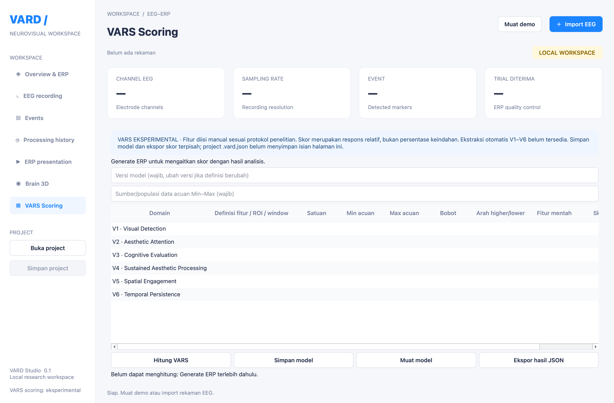

# Konfigurasi VARS Scoring

Status: eksperimental, konfigurasi model tahap awal. Belum ada model penelitian bawaan atau ekstraksi otomatis enam domain dari EEG.

## Alur penggunaan

1. Generate ERP untuk event yang ingin dikaitkan dengan hasil.
2. Buka **VARS Scoring** di sidebar.
3. Isi versi model dan sumber data acuan (populasi, dataset, atau protokol normalisasi).
4. Klik dua kali sel untuk mengisi keenam domain V1–V6: definisi fitur beserta ROI/window, satuan, minimum dan maksimum acuan, bobot, serta arah `higher` atau `lower`.
5. Jumlah bobot harus 1; maksimum acuan harus lebih besar dari minimum. Fitur konstan dalam acuan tidak dapat dinormalisasi Min–Max.
6. **Simpan model** untuk menyimpan konfigurasi JSON. Konfigurasi yang belum lengkap boleh disimpan sebagai draft; perhitungan akan menolaknya sampai lengkap.
7. Isi **Fitur mentah** sesuai definisi dan satuan model, lalu **Hitung VARS**.
8. **Ekspor hasil JSON** menyimpan enam skor domain, fitur mentah, komposit, konfigurasi model lengkap, timestamp, dan provenance analisis. Data sintetis tetap ditandai melalui metadata analisis.

## Perhitungan

Untuk setiap domain: `r = clip((fitur − min) / (max − min), 0, 1)`.
Arah `higher` menghasilkan `100 × r`; arah `lower` menghasilkan `100 × (1 − r)`.
Komposit adalah jumlah `bobot × skor domain`. Angka di luar acuan diberi tanda `*` dan dibatasi ke 0–100; nilai mentah tetap tersimpan di ekspor.

Skor adalah respons relatif eksperimental, bukan persentase keindahan. Definisi fitur dan acuan perlu ditetapkan peneliti serta divalidasi; aplikasi tidak mengasumsikan bahwa amplitudo yang lebih besar selalu berarti respons estetika lebih tinggi.

## Penyimpanan dan batasan

- Model dan hasil disimpan sebagai file JSON terpisah. **Simpan project** belum menyimpan worksheet VARS; simpan model dan ekspor hasil sebelum menutup aplikasi.
- Ganti versi model ketika definisi, acuan, atau bobot berubah. Ekspor menyertakan snapshot konfigurasi untuk audit; aplikasi belum memiliki registry yang mengunci versi model.
- Perubahan isian menghapus hasil lama. Pergantian hasil analisis menghapus fitur mentah agar tidak terbawa ke event lain; konfigurasi model dipertahankan.
- Min–Max tersedia. Z-score, percentile, normalisasi subjek/kelompok otomatis, custom formula, ekstraksi fitur otomatis, dan validasi ilmiah masih tahap berikutnya.

## Fitur tambahan AATR V7B

Buka **VARS Scoring → AATR V7B**. Masukkan |Z| (atau median |Z| untuk
ringkasan kelompok) dan mean ERP dalam µV, lalu klik **Hitung level**.
Tanda kelas mengikuti mean ERP; nol ditulis ±. Besar kelas mengikuti |Z|,
bukan amplitudo µV. Nilai tepat pada batas masuk kelas berikutnya.

Batas asli dari `Q` pada lampiran `AATR_V7B_EMPIRICAL_ANALYSIS.mat`:
0.20373157555087362, 0.4176107284291969, 0.722650407163723,
1.2529173250457815. Kelas A0–A4: Minimal, Low, Moderate, Strong, Very strong.
Ini acuan empiris 43 subjek, bukan ambang universal atau ukuran keindahan.

**Buka hasil MAT** membaca `Q`, `medianAbsZ`, dan `meanAMP` berformat 6 × 3
(Form, Panel, Joint expression, Opening, Colour, Texture; Early 0–200 ms,
P300 300–500 ms, LPP 500–800 ms). Hasil impor merupakan penelitian acuan,
bukan hasil rekaman aktif. Impor mengganti batas kalkulator dengan Q dalam file.
Isian AATR belum disimpan dalam project; file penelitian asli tidak diubah.
Lampiran belum menyertakan source `.m`, ROI, dan definisi normalisasi Z;
karena itu klasifikasi otomatis EEG baru dan temporal profile belum dibuat.

Verifikasi: seluruh 774 kelas subjek cocok dengan CLASSsub dalam MAT;
18 kode ringkasan cocok dengan CSV hasil lampiran. Data subjek tidak disalin
ke repository atau dibundel ke installer.

## Mode Brain 3D tambahan

Di Brain 3D tersedia pilihan **Aktivitas cyan–ungu** dengan latar gelap,
permukaan transparan, partikel dan garis pendek ilustratif. Cyan menunjukkan
potensial positif, ungu negatif; terang mengikuti besar potensial pada skala
tetap sepanjang epoch (kurva visual gamma 0.65). Posisi partikel tetap, sehingga
perubahan berasal dari sampel EEG, bukan aktivitas acak. Pilihan peta potensial
biru–merah tetap tersedia. Efek ini bukan neuron individual, MRI, konektivitas,
source localization, atau peta kelas AATR.

## Dashboard AATR seperti gambar referensi

Buka **VARS Scoring → Dashboard AATR → Buka dashboard FIG**, lalu pilih
`AATR_V7B_EMPIRICAL_NO_TOOLBOX.fig` dari lampiran penelitian. Tidak perlu MATLAB.
Dashboard menampilkan enam kurva ERP dan pita arsiran, temporal prominence,
kartu klasifikasi serta legenda dari data dan label yang tersimpan dalam FIG.
Gunakan toolbar untuk zoom/pan/reset, scroll untuk melihat seluruh gambar,
dan **Ekspor PNG / PDF** untuk menyimpan grafik.

File FIG tidak dibundel otomatis ke installer; pilih file penelitian sendiri.
Importer ini khusus struktur FIG AATR V7B dengan 12 axes, bukan pembaca semua
jenis FIG MATLAB. Tidak ada script atau callback MATLAB yang dijalankan.
Impor FIG tidak menghitung normalisasi, mengubah kalkulator AATR, atau mengaitkan
kurva penelitian dengan rekaman EEG aktif. File MAT ringkasan saja tidak memuat
kurva waktu yang diperlukan; buka FIG untuk dashboard lengkap.
